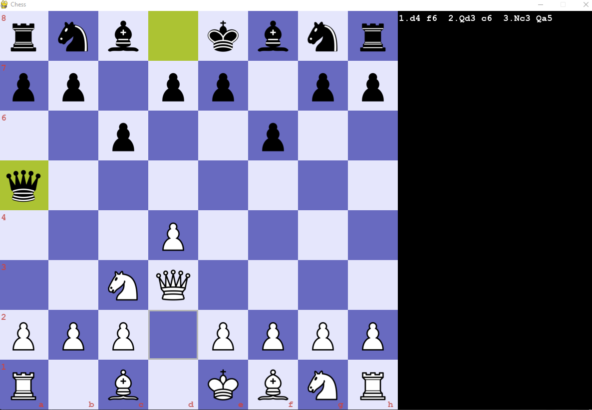

# Python Chess
A GUI chess game including a simple AI, all written in Python.
<p align="center">



</p>

## Index
1. [About](#about)
2. [Demo](#demo)
3. [Usage](#usage)
    * [Installation](#installation)
    * [Commands](#commands)
4. [Credits](#credits)
5. [License](#license)

<a name="about"></a>
## About
This project includes a full chess engine, gui engine, and an AI engine. The AI engine utilizes the minimax and alpha beta pruning algorithms.

<a name="demo"></a>
## Demo
| Human vs Human   | Human vs AI (AI is controlling black)  |
|:----------------------|:------------------|
| |  |


<a name="usage"></a>
## Usage
A link to executable file to play this game is here: For Windows users <a style="color:blue;" href="https://drive.google.com/file/d/1whberk3yM7k9m4i6Gn-LHCxXZ84Q8WeH/view?usp=share_link">CLICK HERE</a>. For Linux users <a style="color:orange;" href="https://drive.google.com/file/d/1acJsgsbm9qi27_SazzMhxmidVgkWVjsD/view?usp=share_link">CLICK HERE</a>. After downloading the zip file, simply unzip and run the executable file.
Additionally, you can use the following installation to clone and run the file locally on your computer.

To install this project, make sure you have the correct version of Python and Pygame. Certain versions of pygame are no longer supported on macOS Catalina.

<a name="installation"></a>
### Installation
- Switch to Python3.
- Follow the code below to create virtual environment and install the necessary libraries.
(Currently tested on Python 3.7.9 with Pygame 2.0.0dev8 and Python 3.8.2 with Pygame 2.0.0 on macOS Catalina)
```
git clone https://github.com/samyarsworld/chess-ai.git
cd chess-ai
python3 -m venv venv
source venv/bin/activate
pip install pygame
cd src
python3 -W ignore main.py
```

<a name="commands"></a>
### Commands
- To start the game, run `python3 -W ignore main.py`, while in the src directory. While you are in the game:
- To undo a move, press `u`.
- To reset the board, press `r`.

<a name="credits"></a>
## Contributors

- SAMYAR FARJAM (https://github.com/samyarsworld)

<a name="license"></a>
## License

This project is licensed under the [MIT License](https://opensource.org/licenses/MIT). See the `LICENSE` file for details.
